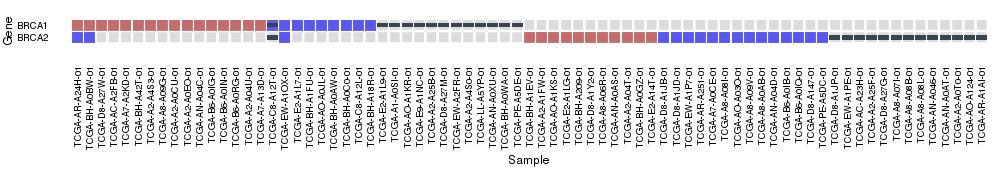

# Find ME

Tool based on [oncoprint](https://github.com/dakl/oncoprint) to explore and plot mutual exclusion patterns of gene alterations.

## Install

Install it from local source:

```{r}
install.packages("/path/find.me", repos = NULL, type="source")
```

Or install it directly from GitHub:

```{r}
library(devtools)
install_github("hclimente/find.me")
```

## Usage

### Create oncoprint

This package can be used to create beautiful oncoprints in R. 

```{r}
library(find.me)
data(tcga_brca)
# vertical x-labels
vert_x <- theme(axis.text.x = element_text(angle = 90, hjust = 1, vjust=.5))

oncoprint(tcga_brca) + coord_fixed() + vert_x
```



The main function (`oncoprint(M)`) works on a matrix of strings on on this form: 

```
      TCGA-BH-A1EV-01 TCGA-A2-A1FW-01 TCGA-AO-A1KS-01 TCGA-D8-A1JB-01 TCGA-D8-A1JD-01
BRCA1 ""              ""              ""              ""              ""             
BRCA2 "AMP;"          "AMP;"          "AMP;"          "HOMDEL;"       "HOMDEL;"      
```

Row names are genes, column names are samples. The following annotations are allowed by default: 

* Ampilifications (`AMP`), red fill
* Deletions (`HOMDEL`), blue fill
* Somatic mutations (`MUT`), black box
* Splicing alterations (`SPLICING`), green box
* Germline mutations (`GERMLINE`), purple box
* Upregulation (`UP`), red outline
* Downregulation (`DOWN`), blue outline

Each element is changable by passing (defaults listed below)

```{r}
keys=list(somatic="MUT", germline="GERMLINE", amp="AMP", 
          del="HOMDEL", upreg="UP", downreg="DOWN", splicing="SPLICING")
```

to the function call. Also, the genes can be sorted by most altered gene by passing `sortGenes = TRUE` (default `FALSE`, which keeps order from matrix). Samples are always sorted using an adaptation of the algorithm used in cBioPortal. 

### Assess significance

I implemented some methods to test the mutual exclusion in your data. Please, take into account that these tests will only make sense if you include all the analyzed samples, not only those with an alteration in the studied genes.

#### Conservative, Fisher's test based method

This test is described in [Babur et al.](http://www.ncbi.nlm.nih.gov/pmc/articles/PMC4381444/) as a scoring input for their algorithm to find mutual exclusion modules. It performs a Fisher's test to find unbalances between each of the genes and the aggregation of the rest. After correcting for multiple testing, returns the higher p-value as representative of the gene set.

```{r}
library(find.me)
data(tcga_brca)
mutmat <- getSortedMatrix(tcga_brca)$mutmat
me.test.fisher(mutmat)
# [1] 6.495643e-17
```

#### Matrix weight-based method

I implemented the weight function *W* described in [Dendrix paper](http://www.ncbi.nlm.nih.gov/pubmed/21653252) as a statistic to measure the mutual exclusion. By permuting the mutation matrix keeping the number of alterations per gene constant, it calculates a distribution of *W* from which an empirical p-value is inferred. The minimum p-value is 1/(# permutations).

```{r}
library(find.me)
data(tcga_brca)
mutmat <- getSortedMatrix(tcga_brca)$mutmat
# 10000 permutations
me.test.permutateSamples(mutmat, n=10000)
# [1] 1e-04
```